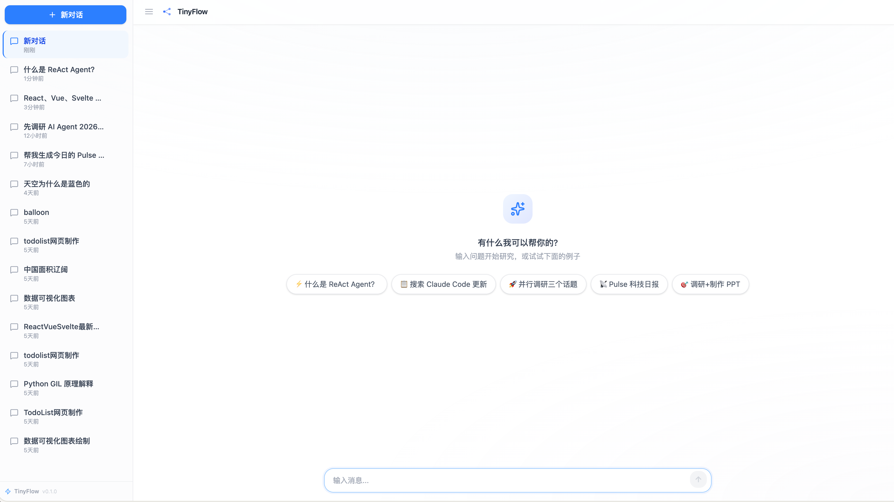
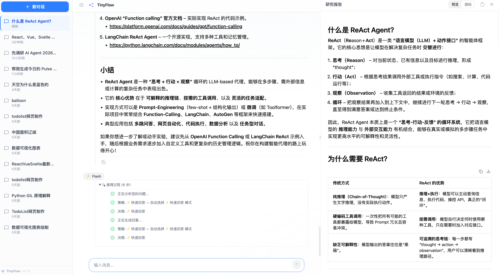
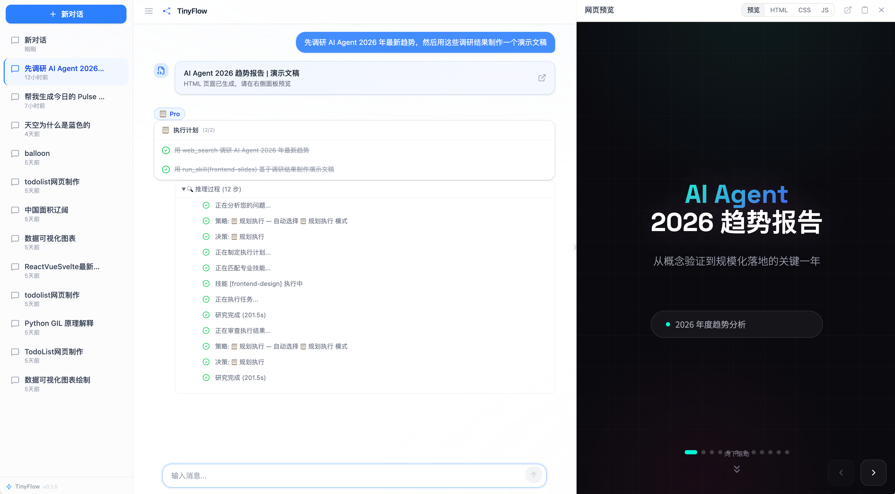
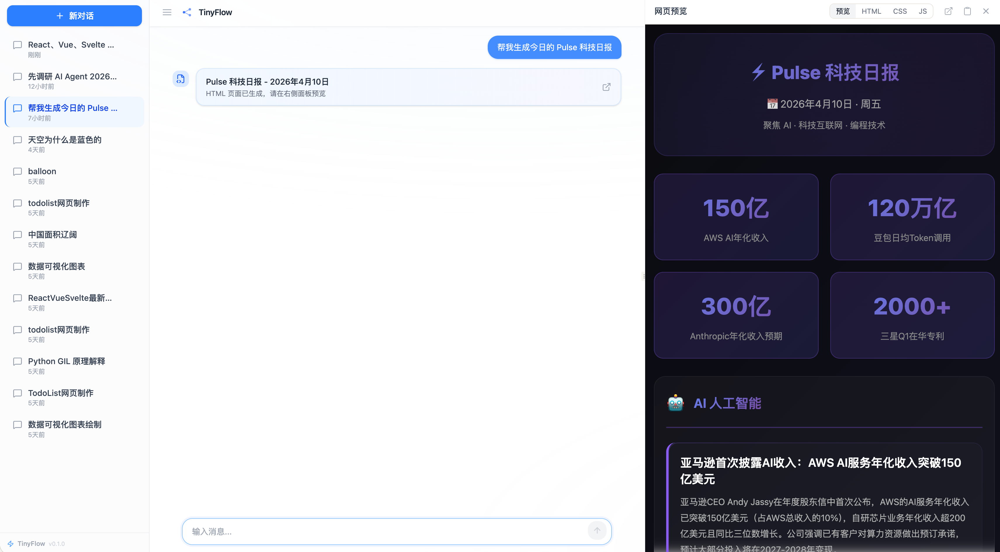
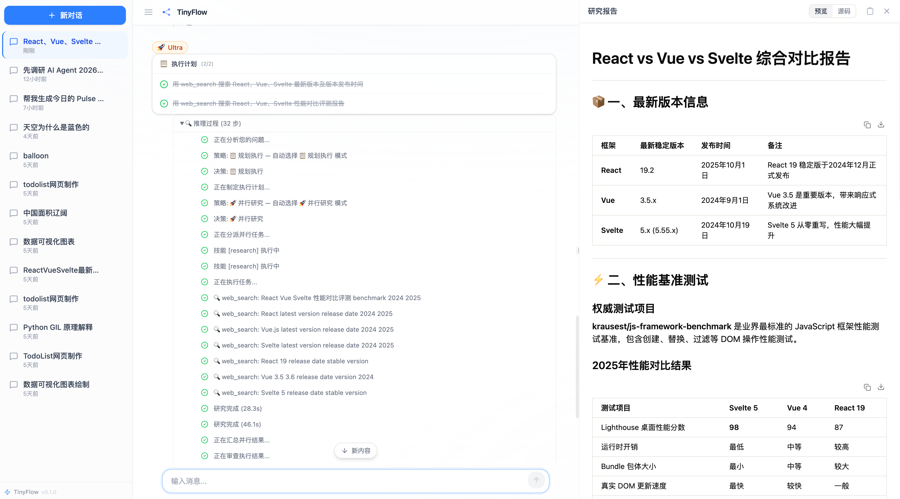
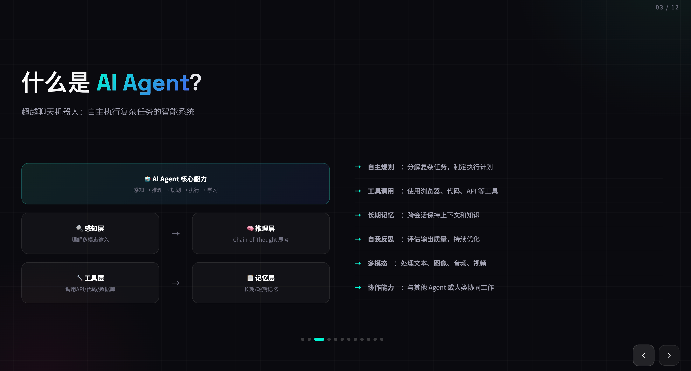
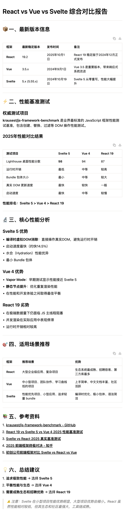

<div align="center">

# TinyFlow

**Lightweight multi-agent orchestration engine**


<a href="#english">English</a> | <a href="#中文">中文</a>



</div>

---

<a id="english"></a>

## English

### What is TinyFlow?

TinyFlow is a lightweight multi-agent orchestration engine built on LangGraph. It routes user queries through four distinct execution modes -- from instant answers to parallel research -- with real-time streaming, persistent memory, and a skill plugin system.

### Features

- :zap: **4 Execution Modes** -- Flash (direct answer), Thinking (deep reasoning), Pro (plan & execute), Ultra (parallel research)
- :robot: **ReAct Agent** -- Observe-Think-Act loop with multi-tool support (web search, skill invocation)
- :jigsaw: **Graph-based Orchestration** -- LangGraph-powered state machine with configurable middleware pipeline
- :satellite: **Real-time Streaming** -- Server-Sent Events with 12+ event types and per-thread independent connections
- :brain: **Memory System** -- Fact extraction, confidence scoring, time-decay merging, and context injection
- :electric_plug: **Skill System** -- YAML frontmatter registry with keyword matching and hot-reload
- :art: **Artifact Panel** -- Live HTML/CSS/JS preview for generated code and visualizations
- :test_tube: **302 Tests** -- 272 backend (pytest) + 30 frontend (vitest)

### Preview

<table>
<tr>
<td align="center" width="50%">
<br/>
<strong>Flash</strong> -- Instant answers with rich markdown
</td>
<td align="center" width="50%">
<br/>
<strong>Pro</strong> -- Plan, execute, and generate artifacts
</td>
</tr>
<tr>
<td align="center" width="50%">
<br/>
<strong>Pro + Skill</strong> -- Pulse daily tech news with live preview
</td>
<td align="center" width="50%">
<br/>
<strong>Ultra</strong> -- Parallel deep research with report
</td>
</tr>
</table>

### Artifact Showcase

TinyFlow generates production-ready artifacts — from interactive slides to research reports — all rendered live in the built-in preview panel.

<table>
<tr>
<td align="center">
<br/>
<strong>Interactive Slides</strong> -- AI Agent 2026 trend report, auto-generated presentation
</td>
</tr>
<tr>
<td align="center">
<br/>
<strong>Pulse Daily News</strong> -- AI & tech daily digest with stats, categories, and trend highlights
</td>
</tr>
<tr>
<td align="center">
<br/>
<strong>Deep Research Report</strong> -- React vs Vue vs Svelte comprehensive benchmark analysis
</td>
</tr>
</table>

### Architecture

```
User
 |
 v
+------------------+     SSE Stream     +------------------+
|    Frontend      | ◀───────────────── |   API Gateway    |
|    Next.js 16    | ──── REST ────────▶|   FastAPI        |
|    React 19      |                    |   /chat /threads |
+------------------+                    +--------+---------+
                                                 |
                                          +------v-------+
                                          | Graph Engine  |
                                          | (LangGraph)   |
                                          +------+-------+
                                                 |
              +----------+----------+----------+---------+
              |          |          |          |         |
           Router    Planner   Dispatch   Executor  Reflector
              |          |          |          |         |
              |          |          |    +-----+-----+   |
              |          |          |    | ReAct Agent|   |
              |          |          |    | (Observe → |   |
              |          |          |    |  Think →   |   |
              |          |          |    |  Act loop) |   |
              |          |          |    +-----+-----+   |
              +-----+----+----------+---------+---------+
                    |
         +----------+-----------+
         |          |           |
      Memory    Middleware    Skills
      Engine     Chain       Registry
         |          |           |
         v          v           v
       Facts    Loop/TODO    YAML Plugins
       Store    Detection    (hot-reload)
```

### Quick Start

**Prerequisites**

- Python 3.12+
- Node.js 20+ with pnpm
- [uv](https://github.com/astral-sh/uv) (Python package manager)
- At least one LLM API key (MiniMax, GLM, OpenAI, or Anthropic)

**1. Clone the repository**

```bash
git clone https://github.com/venaissance/tiny-flow.git
cd tiny-flow
```

**2. Backend setup**

```bash
cd backend

# Copy environment file and add your API key
cp .env.example .env
# Edit .env — at minimum, set one of: MINIMAX_API_KEY, GLM_API_KEY, OPENAI_API_KEY, ANTHROPIC_API_KEY

# Install dependencies and start the dev server
uv sync
make dev
# API server starts at http://localhost:8000
```

**3. Frontend setup** (new terminal)

```bash
cd frontend

# Install dependencies
pnpm install

# Start the dev server
pnpm dev
# Open http://localhost:3000
```

### Project Structure

```
tiny-flow/
├── backend/
│   ├── app/
│   │   └── gateway/            # FastAPI application and route handlers
│   │       ├── app.py          # ASGI entry point
│   │       └── routers/        # /chat, /threads endpoints
│   ├── core/
│   │   ├── graph/              # LangGraph state machine
│   │   │   ├── builder.py      # Graph construction with middleware
│   │   │   ├── state.py        # GraphState TypedDict
│   │   │   └── nodes/          # router, plan, dispatch, execute, merge, reflect, respond, skill
│   │   ├── executor/           # ReAct Agent with multi-tool support + ExecutorPool
│   │   ├── memory/             # Fact extraction → scoring → merging → injection
│   │   ├── middleware/         # Loop detection, TODO tracking, context compaction
│   │   ├── models/             # Multi-provider LLM factory (OpenAI, Claude, GLM, MiniMax)
│   │   ├── skills/             # YAML skill registry and router
│   │   └── tools/              # Web search, skill invocation
│   ├── skills/                 # Built-in skill definitions (YAML frontmatter)
│   ├── tests/                  # 272 pytest tests
│   ├── config.yaml             # Model, executor, memory, skill configuration
│   ├── Makefile                # install / dev / test / clean
│   └── pyproject.toml
├── frontend/
│   ├── src/
│   │   ├── app/                # Next.js pages and API routes
│   │   ├── components/
│   │   │   ├── chat/           # Chat UI, message rendering, mode selector
│   │   │   ├── inspector/      # Artifact preview panel
│   │   │   └── ui/             # Shared UI components (Radix-based)
│   │   ├── hooks/              # SSE streaming, thread management
│   │   ├── core/               # Config, streaming markdown parser
│   │   └── lib/                # Utilities
│   ├── e2e/                    # Playwright E2E tests
│   ├── package.json
│   └── vitest.config.ts
└── docs/
    └── assets/                 # Screenshots
```

### Configuration

All backend configuration is in `backend/config.yaml`:

```yaml
model:
  default: "MiniMax-M2.7"           # Default LLM model
  providers:                        # Available LLM providers
    - name: openai
    - name: claude
    - name: glm
    - name: minimax

executor:
  scheduler_workers: 3              # Parallel task scheduling
  execution_workers: 3              # Concurrent task execution
  default_timeout: 300              # Task timeout (seconds)

memory:
  token_budget: 500                 # Max tokens for memory injection
  decay_days: 30                    # Confidence decay period
  min_confidence: 0.7               # Minimum fact confidence threshold
  max_facts: 50                     # Maximum stored facts

skills:
  dirs: [skills/]                   # Skill definition directories
  hot_reload: true                  # Watch for skill file changes

graph:
  max_iterations: 3                 # Maximum plan-execute loop iterations
```

### Testing

```bash
# Backend unit & integration tests (272 tests)
cd backend
make test

# Frontend unit tests (30 tests)
cd frontend
pnpm test:run
```

### Tech Stack

| Category | Technology | Purpose |
|----------|-----------|---------|
| LLM Orchestration | LangGraph, LangChain | State machine, ReAct agent, model abstraction |
| Backend Framework | FastAPI, Uvicorn | REST API, SSE streaming |
| Frontend Framework | Next.js 16, React 19 | App router, server components |
| Styling | Tailwind CSS 4 | Utility-first CSS |
| UI Components | Radix UI, Motion | Accessible primitives, animation |
| Code Editor | CodeMirror 6 | Artifact code editing |
| State Management | TanStack Query | Server state synchronization |
| Testing | pytest, vitest, Playwright | Backend, frontend, E2E |
| Package Management | uv, pnpm | Fast, deterministic installs |
| Language | Python 3.12, TypeScript 5.8 | Type safety on both ends |

### Contributing

1. Fork the repository
2. Create a feature branch: `git checkout -b feat/your-feature`
3. Write tests for your changes
4. Ensure all tests pass: `make test` (backend) and `pnpm test:run` (frontend)
5. Submit a pull request

### License

[MIT](LICENSE)

---

<a id="中文"></a>

## 中文

### TinyFlow 是什么？

TinyFlow 是一个基于 LangGraph 的轻量级多智能体编排引擎。它将用户请求智能路由到四种执行模式——从即时回答到并行研究——同时提供实时流式推送、持久化记忆和技能插件系统。

### 核心特性

- :zap: **四种执行模式** -- Flash（直接回答）、Thinking（深度推理）、Pro（规划执行）、Ultra（并行研究）
- :robot: **ReAct Agent** -- Observe-Think-Act 循环，支持多工具调用（网页搜索、技能调用）
- :jigsaw: **图编排引擎** -- 基于 LangGraph 的状态机，支持可配置的中间件管道
- :satellite: **实时流推送** -- SSE 支持 12+ 事件类型，每个会话独立连接，支持并发执行
- :brain: **记忆系统** -- 事实提取 → 置信度评分 → 时间衰减合并 → 上下文注入
- :electric_plug: **技能系统** -- YAML frontmatter 注册，关键词匹配，文件变更热重载
- :art: **产物面板** -- 生成的 HTML/CSS/JS 代码实时预览
- :test_tube: **302 个测试** -- 272 后端（pytest）+ 30 前端（vitest）

### 模式预览

<table>
<tr>
<td align="center" width="50%">
<br/>
<strong>Flash</strong> -- 即时回答，丰富 Markdown 排版
</td>
<td align="center" width="50%">
<br/>
<strong>Pro</strong> -- 任务规划、分步执行、产物生成
</td>
</tr>
<tr>
<td align="center" width="50%">
<br/>
<strong>Pro + 技能</strong> -- Pulse 科技日报，实时预览
</td>
<td align="center" width="50%">
<br/>
<strong>Ultra</strong> -- 并行深度研究与报告生成
</td>
</tr>
</table>

### 产物展示

TinyFlow 可生成高质量产物——从交互式幻灯片到深度研究报告——均在内置预览面板中实时渲染。

<table>
<tr>
<td align="center">
<br/>
<strong>交互式幻灯片</strong> -- AI Agent 2026 趋势报告，自动生成演示文稿
</td>
</tr>
<tr>
<td align="center">
<br/>
<strong>Pulse 科技日报</strong> -- AI 与科技日报，含数据统计、分类聚合、趋势高亮
</td>
</tr>
<tr>
<td align="center">
<br/>
<strong>深度研究报告</strong> -- React vs Vue vs Svelte 综合性能基准分析
</td>
</tr>
</table>

### 系统架构

```
用户
 |
 v
+------------------+     SSE 事件流     +------------------+
|    前端           | ◀───────────────── |   API 网关        |
|    Next.js 16    | ──── REST ────────▶|   FastAPI        |
|    React 19      |                    |   /chat /threads |
+------------------+                    +--------+---------+
                                                 |
                                          +------v-------+
                                          |  图引擎       |
                                          | (LangGraph)   |
                                          +------+-------+
                                                 |
              +----------+----------+----------+---------+
              |          |          |          |         |
            路由器      规划器      调度器     执行器    反思器
              |          |          |          |         |
              |          |          |    +-----+-----+   |
              |          |          |    | ReAct Agent|   |
              |          |          |    | (观察 →    |   |
              |          |          |    |  思考 →    |   |
              |          |          |    |  行动 循环) |   |
              |          |          |    +-----+-----+   |
              +-----+----+----------+---------+---------+
                    |
         +----------+-----------+
         |          |           |
       记忆引擎   中间件链      技能注册
         |          |           |
         v          v           v
       事实存储   循环/TODO    YAML 插件
                 检测        (热重载)
```

### 快速开始

**环境要求**

- Python 3.12+
- Node.js 20+，安装 pnpm
- [uv](https://github.com/astral-sh/uv)（Python 包管理器）
- 至少一个 LLM API Key（MiniMax、GLM、OpenAI 或 Anthropic）

**1. 克隆仓库**

```bash
git clone https://github.com/venaissance/tiny-flow.git
cd tiny-flow
```

**2. 启动后端**

```bash
cd backend

# 复制环境变量文件，填入 API Key
cp .env.example .env
# 编辑 .env，至少设置一个：MINIMAX_API_KEY、GLM_API_KEY、OPENAI_API_KEY、ANTHROPIC_API_KEY

# 安装依赖并启动开发服务器
uv sync
make dev
# API 服务运行在 http://localhost:8000
```

**3. 启动前端**（新开终端）

```bash
cd frontend

# 安装依赖
pnpm install

# 启动开发服务器
pnpm dev
# 打开 http://localhost:3000
```

### 项目结构

```
tiny-flow/
├── backend/
│   ├── app/
│   │   └── gateway/            # FastAPI 应用和路由处理
│   │       ├── app.py          # ASGI 入口
│   │       └── routers/        # /chat, /threads 端点
│   ├── core/
│   │   ├── graph/              # LangGraph 状态机
│   │   │   ├── builder.py      # 图构建（含中间件绑定）
│   │   │   ├── state.py        # GraphState 类型定义
│   │   │   └── nodes/          # router, plan, dispatch, execute, merge, reflect, respond, skill
│   │   ├── executor/           # ReAct Agent（多工具支持）+ ExecutorPool
│   │   ├── memory/             # 事实提取 → 评分 → 合并 → 注入
│   │   ├── middleware/         # 循环检测、TODO 跟踪、上下文压缩
│   │   ├── models/             # 多 Provider LLM 工厂（OpenAI、Claude、GLM、MiniMax）
│   │   ├── skills/             # YAML 技能注册中心和路由器
│   │   └── tools/              # 网页搜索、技能调用
│   ├── skills/                 # 内置技能定义（YAML frontmatter）
│   ├── tests/                  # 272 个 pytest 测试
│   ├── config.yaml             # 模型、执行器、记忆、技能配置
│   ├── Makefile                # install / dev / test / clean
│   └── pyproject.toml
├── frontend/
│   ├── src/
│   │   ├── app/                # Next.js 页面和 API 路由
│   │   ├── components/
│   │   │   ├── chat/           # 聊天 UI、消息渲染、模式选择
│   │   │   ├── inspector/      # 产物预览面板
│   │   │   └── ui/             # 共享 UI 组件（基于 Radix）
│   │   ├── hooks/              # SSE 流式推送、会话管理
│   │   ├── core/               # 配置、流式 Markdown 解析器
│   │   └── lib/                # 工具函数
│   ├── e2e/                    # Playwright 端到端测试
│   ├── package.json
│   └── vitest.config.ts
└── docs/
    └── assets/                 # 截图
```

### 配置说明

后端配置集中在 `backend/config.yaml`：

```yaml
model:
  default: "MiniMax-M2.7"           # 默认 LLM 模型
  providers:                        # 可用 LLM 提供商
    - name: openai
    - name: claude
    - name: glm
    - name: minimax

executor:
  scheduler_workers: 3              # 并行任务调度数
  execution_workers: 3              # 并发任务执行数
  default_timeout: 300              # 任务超时（秒）

memory:
  token_budget: 500                 # 记忆注入的 token 预算
  decay_days: 30                    # 置信度衰减周期
  min_confidence: 0.7               # 最低事实置信度阈值
  max_facts: 50                     # 最大存储事实数

skills:
  dirs: [skills/]                   # 技能定义目录
  hot_reload: true                  # 监听技能文件变更

graph:
  max_iterations: 3                 # 规划-执行循环最大迭代次数
```

### 运行测试

```bash
# 后端单元与集成测试（272 个）
cd backend
make test

# 前端单元测试（30 个）
cd frontend
pnpm test:run
```

### 技术栈

| 类别 | 技术 | 用途 |
|------|------|------|
| LLM 编排 | LangGraph, LangChain | 状态机、ReAct Agent、模型抽象层 |
| 后端框架 | FastAPI, Uvicorn | REST API、SSE 流式推送 |
| 前端框架 | Next.js 16, React 19 | App Router、Server Components |
| 样式 | Tailwind CSS 4 | 原子化 CSS |
| UI 组件 | Radix UI, Motion | 无障碍基础组件、动画 |
| 代码编辑器 | CodeMirror 6 | 产物代码编辑 |
| 状态管理 | TanStack Query | 服务端状态同步 |
| 测试 | pytest, vitest, Playwright | 后端、前端、端到端 |
| 包管理 | uv, pnpm | 快速确定性安装 |
| 语言 | Python 3.12, TypeScript 5.8 | 前后端类型安全 |

### 参与贡献

1. Fork 本仓库
2. 创建特性分支：`git checkout -b feat/your-feature`
3. 为你的改动编写测试
4. 确保所有测试通过：`make test`（后端）和 `pnpm test:run`（前端）
5. 提交 Pull Request

### 许可证

[MIT](LICENSE)
